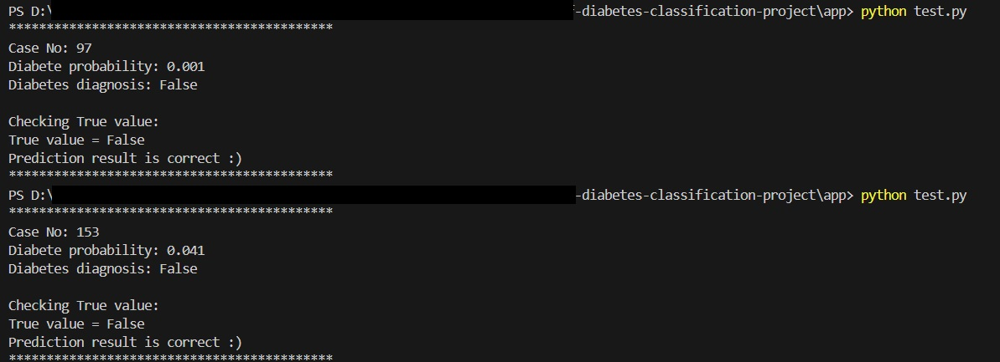

# Diabetes Prediction Model


## Project Overview
This project is part of the MLZoomcamp course provided by DataTalkClub. It implements a machine learning model for diabetes prediction using various classification algorithms, with XGBoost being the final chosen model due to its superior performance.

## Table of Contents
- [Data](#data)
- [Project Structure](#project-structure)
- [Model Development](#model-development)
- [Model Deployment](#model-deployment)
- [Usage](#usage)
- [Installation](#installation)

## Data
The project uses the Diabetes Dataset from Kaggle. The dataset includes several health metrics used to predict diabetes:
- Glucose level
- Blood pressure
- Skin thickness
- Insulin
- BMI (Body Mass Index)
- Age
- And other relevant features

## Project Structure
```
├── app/
│   ├── predict.py     # Flask application for model serving
│   └── test.py        # Test script for the deployed model
├── bins/
│   └── model.bin      # Trained model binary file
├── data/
│   └── diabetes_dataset.csv  # Dataset
├── Dockerfile         # Docker configuration
└── requirements.txt   # Project dependencies
```

## Model Development
The development process included:

1. **Data Preparation & Cleaning**
   - Feature engineering
   - Handling zero values in features
   - Train-test split

2. **Exploratory Data Analysis**
   - Feature correlation analysis
   - Distribution analysis
   - Feature importance evaluation

3. **Model Selection**
   - Tested multiple algorithms:
     - `Logistic Regression`
     - `Decision Tree`
     - `Random Forest`
     - `XGBoost`
     - `CatBoost`
   - Cross-validation for model evaluation
   - Hyperparameter tuning using `Optuna` (baseline `recall` score increased from 0.605 to 0.709)
   

4. **Final Model**
   - XGBoost classifier was chosen as the best performing model
   - Key metrics on test data:
     - `Accuracy`
     - `Precision`
     - `Recall` (prioritized for medical diagnosis)
     - `F1 Score`
     - `ROC AUC`

Please reffer to `./experiments/diabete-eda-model.ipynb` to explore details.

## Model Deployment
The model is deployed as a `Flask` web service and containerized using Docker.

### API Endpoint
- **URL**: `/predict`
- **Method**: POST
- **Input**: JSON with patient health metrics
- **Output**: Probability of diabetes and binary prediction

## Usage

### Running with Docker

1. Clone the repository

2. Run the container:
```bash
docker run -p 9696:9696 diabetes-prediction
```

### Making Predictions
1. You can use the `app/test.py` script 


You will see something like this:




2. Also you can make direct API calls:

```python
import requests

# Example data
patient_data = {
    "glucose": 120,
    "bloodpressure": 70,
    "skinthickness": 20,
    "insulin": 79,
    "bmi": 25.4,
    "age": 45
    # ... other features
}

# Make prediction
response = requests.post("http://localhost:9696/predict", json=patient_data)
result = response.json()
print(result)
```

## Installation

### Local Development
1. Clone the repository
2. Install dependencies:
```bash
pip install -r requirements.txt
```

3. Run the Flask application:
```bash
python app/predict.py
```

### Requirements
See `requirements.txt` for a complete list of dependencies.

## Notes
- The model prioritizes recall over precision due to the medical nature of the prediction task
- Feature engineering decisions were made based on domain knowledge and data analysis
- The service is configured to run on port 9696 by default


## Acknowledgements
I would like to express our gratitude to DataTalksClub and to Alexey Grigorev. You are the best.